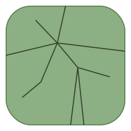
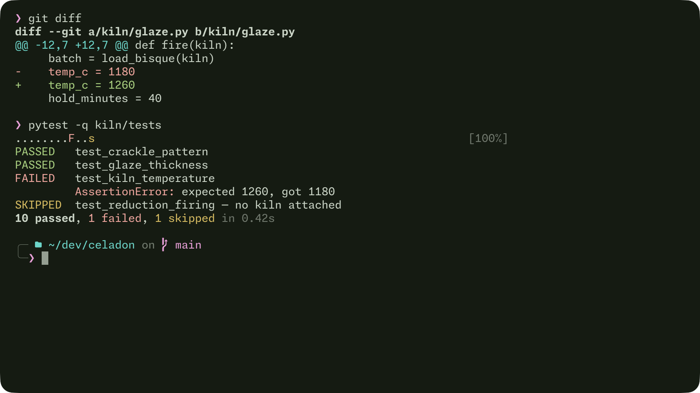
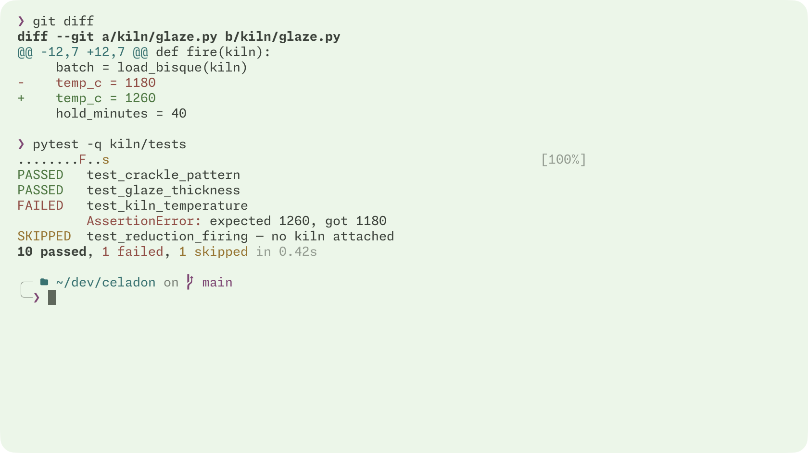
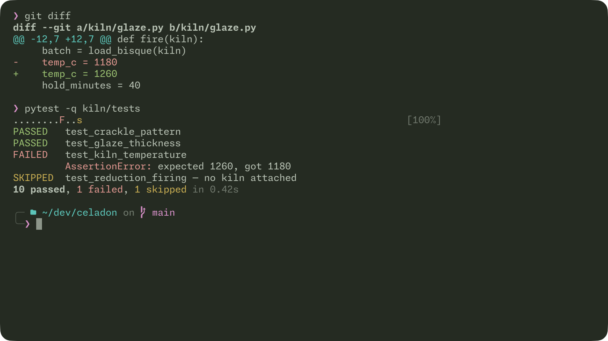
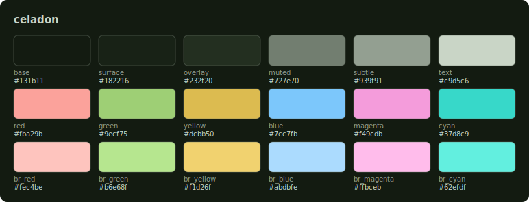
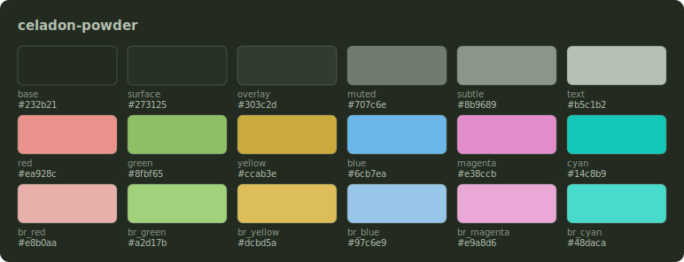
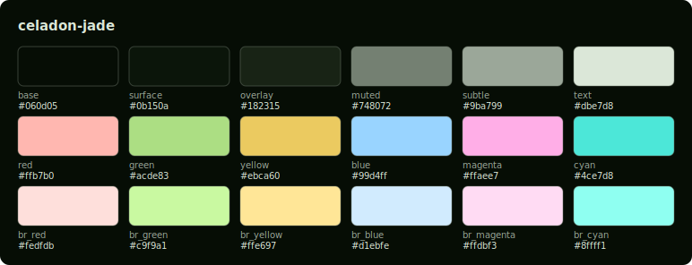
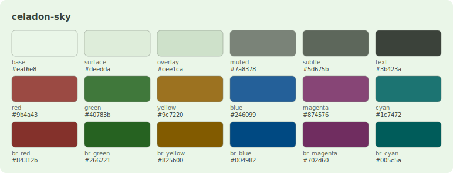

<p align="center">
  <picture>
    <source media="(prefers-color-scheme: dark)" srcset="assets/celadon-logo-dark.svg">
    <source media="(prefers-color-scheme: light)" srcset="assets/celadon-logo-light.svg">
    
  </picture>
</p>

<h1 align="center">Celadon</h1>

<p align="center"><em>calm green. honest color.</em></p>

<p align="center">
  <a href="https://celadontheme.com">celadontheme.com</a> ·
  <a href="https://github.com/celadon-theme/celadon-theme/actions/workflows/ci.yml"></a>
</p>

---

A sage-green theme family for terminals and editors, named for the pale
grey-green ceramic glaze.

Celadon keeps the field calm — low-saturation sage, dark or light — while the
accents stay **honest to their ANSI meaning**: red is red, green is green, so
diffs, test output, and prompts read the way they should. Accents sit in a
tight loudness band so syntax never outranks your content.

The palettes are **generated, not hand-tuned**: a small set of OKLCH parameters
and rules, with every build gated on APCA contrast and accent-distinctness
checks.

<p align="center"></p>

## Variants

One graded family, light → dark: **sky → powder → celadon → jade**.

| variant | field | for |
|---|---|---|
| `celadon-sky` | light · sage paper | daytime |
| `celadon-powder` | dark · low contrast | night, dim rooms |
| `celadon` | dark · medium contrast | **the default** |
| `celadon-jade` | dark · high contrast | bright rooms, glare |

<details><summary>Same content in every variant</summary>
<p align="center">
  
  
  
</p>
</details>

## Install

Every port ships all four variants as plain files — copy or curl, nothing to
install.

### Ghostty

```sh
mkdir -p ~/.config/ghostty/themes
curl -o ~/.config/ghostty/themes/celadon \
  https://raw.githubusercontent.com/celadon-theme/celadon-theme/main/ports/ghostty/celadon
```

Then in `~/.config/ghostty/config`:

```
theme = celadon
```

More, including following the system appearance: [ports/ghostty](ports/ghostty/).

### iTerm2

```sh
curl -O https://raw.githubusercontent.com/celadon-theme/celadon-theme/main/ports/iterm2/celadon.itermcolors
open celadon.itermcolors
```

Then **Settings → Profiles → Colors → Color Presets… → celadon**.
Details: [ports/iterm2](ports/iterm2/).

### oh-my-posh (the prompt)

The prompt from the screenshots ships as a port too. It contains no hexes —
every color is an ANSI slot, so it follows whichever Celadon variant your
terminal runs. Needs a Nerd Font.

```sh
curl --create-dirs -o ~/.config/oh-my-posh/celadon.omp.toml \
  https://raw.githubusercontent.com/celadon-theme/celadon-theme/main/ports/oh-my-posh/celadon.omp.toml
```

Then add to `~/.zshrc` (other shells: [ports/oh-my-posh](ports/oh-my-posh/)):

```sh
eval "$(oh-my-posh init zsh --config ~/.config/oh-my-posh/celadon.omp.toml)"
```

### Something else?

[Request a port](../../issues/new/choose) — flat-file ports are one small
emitter each, so asking is usually enough. Neovim is next, in its own repo.

### Fonts

Celadon never sets your font — every port is colors only. For the look in
the screenshots:

- **Terminal font**: [Monaspace Neon](https://monaspace.githubnext.com) —
  `brew install --cask font-monaspace`, or grab it from the
  [releases](https://github.com/githubnext/monaspace/releases).
- **Prompt glyphs**: the oh-my-posh port needs Nerd Font symbols. Ghostty
  bundles them, so any font just works. Terminals that don't (iTerm2
  included) need a patched build — `brew install --cask font-monaspace-nf`,
  then select **MonaspiceNe Nerd Font** (Nerd Fonts' renamed Monaspace
  Neon), or any font from [nerdfonts.com](https://www.nerdfonts.com).

## Palette

<p align="center"></p>

<details><summary><code>celadon-powder</code></summary>
<p align="center"></p>
</details>

<details><summary><code>celadon-jade</code></summary>
<p align="center"></p>
</details>

<details><summary><code>celadon-sky</code></summary>
<p align="center"></p>
</details>

Machine-readable palette: [`ports/json/`](ports/json/) — slug → role → hex,
one file per variant.

## Generated, not hand-tuned

Every hex in this repo is build output from [`generator/`](generator/):
OKLCH parameters → gamut-fitted sRGB, hard-gated on APCA text and accent
contrast and pairwise accent distinctness, with a color-vision-deficiency
audit on top. CI re-runs the gates and regenerates every port on each change
— committed files cannot drift from the generator.

## Repo layout

This is the hub repo for the [`celadon-theme`](https://github.com/celadon-theme)
org. It holds the palette generator (the source of truth), flat-file ports
under [`ports/<app>/`](ports/), and logo/screenshot assets. Ports that a
plugin manager installs from a repo root (Neovim, tmux, …) get their own
repos under the org.

## Contributing

Issues — port requests, color problems, screenshots — are the most useful
thing right now. Before touching any hex value, read
[CONTRIBUTING.md](CONTRIBUTING.md): the palettes are generated, so fixes go
through the generator, never through hand-edited output.

## License

[MIT](LICENSE)
